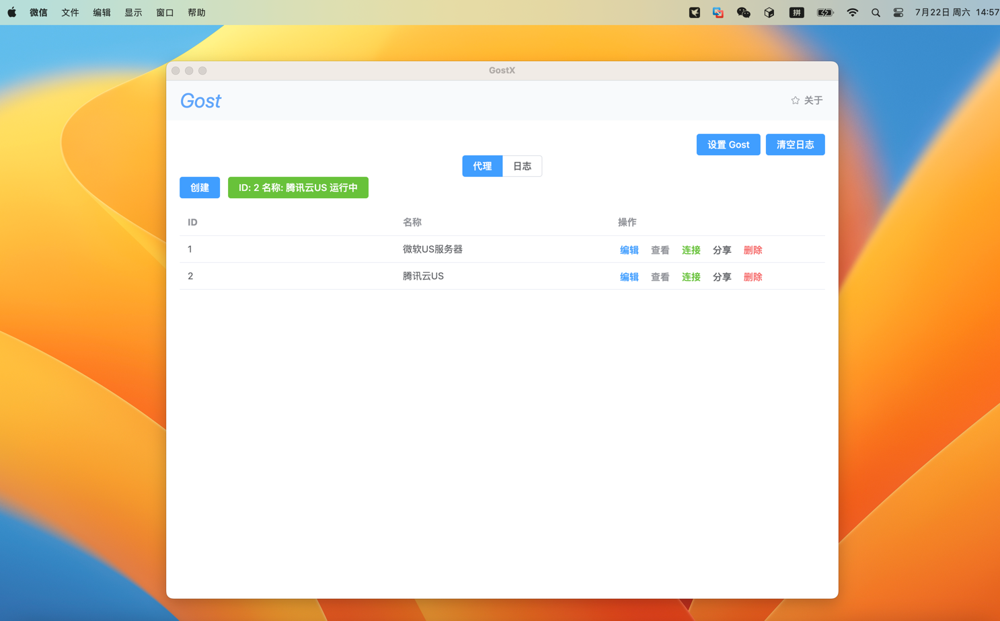
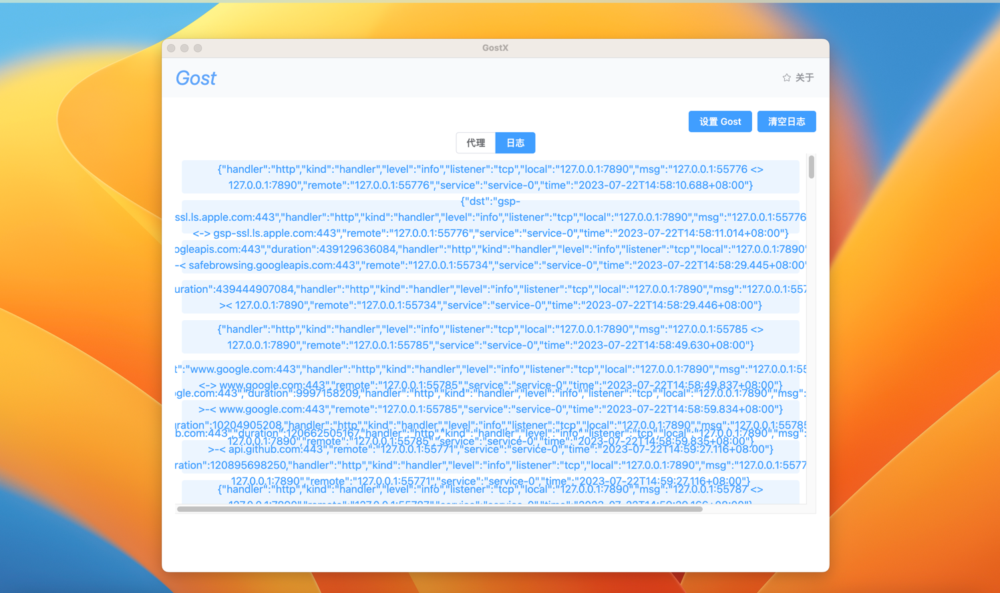

<h1>Gostx</h1>

## 简介

Gostx 是一个基于 [Gost](https://github.com/ginuerzh/gost.git) 的代理工具 GUI，它支持操作系统(Windows、Linux、MacOS) 和 gost 多种协议，包括 Socks5、Shadowsocks、ShadowsocksR、Http、Https 等。

[使用教程](https://github.com/InfernalAzazel/gostx/issues/1)

## 功能

- 完全支持 gost 多种协议
- 支持多个代理服务器
- 支持 分享 详细 编辑 删除 代理服务器
- 支持自定义配置 gost 命令
- 支持自定义配置 gost 配置版本
- 支持日志查看

## 效果

## 下载

[下载地址](https://github.com/InfernalAzazel/gostx/releases)
